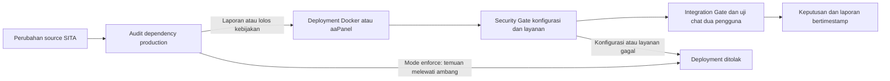

# Draft Sinopsis Skripsi

## Judul

**Implementasi dan Evaluasi Security Gate Berbasis DevSecOps untuk Meningkatkan Keamanan Deployment Sistem Informasi Tugas Akhir pada Lingkungan Docker dan aaPanel**

**Mahasiswa:** Muhamad Sari Rizki

**NIM:** `[diisi]`
**Program Studi:** S1 Ilmu Komputer, Fakultas Teknik, Universitas Bumigora

## Latar Belakang

Sistem Informasi Tugas Akhir (SITA) digunakan untuk mendukung proses bimbingan tugas akhir. Aplikasi Laravel ini memiliki layanan HTTP, basis data, queue, scheduler, dan komunikasi real-time Reverb. Dalam proses pengembangannya, SITA berhasil diuji pada Docker, tetapi ketika dipasang pada aaPanel muncul perbedaan lingkungan, termasuk komunikasi chat yang tidak diterima tanpa refresh dan konfigurasi layanan yang berbeda dari container. Masalah tersebut menunjukkan bahwa deployment yang tampak berhasil belum tentu menjamin layanan real-time, konfigurasi server, dan kontrol keamanan benar-benar bekerja.

Pemeriksaan awal pada dua VM laboratorium menemukan dua kondisi yang perlu dikendalikan: origin Reverb memakai wildcard dan respons HTTP belum memiliki header keamanan utama. Setelah konfigurasi diperbaiki, masih ada risiko bahwa perubahan berikutnya dapat mengaktifkan debug, melonggarkan permission `.env`, menghapus header Nginx, membuka endpoint sensitif, atau memasukkan dependensi dengan advisory keamanan. Pemeriksaan manual melalui GUI aaPanel atau terminal juga tidak konsisten karena bergantung pada pengalaman administrator dan perbedaan toolchain antarserver.

DevSecOps menempatkan kontrol keamanan sebagai bagian otomatis dari siklus pengiriman perangkat lunak. Rajapakse dkk. mengidentifikasi otomasi, shift-left security, dan penilaian keamanan berkelanjutan sebagai kebutuhan penting dalam adopsi DevSecOps [1]. Kumar dan Goyal mengusulkan continuous security melalui kontrol yang dikodekan pada titik-titik workflow delivery [2]. Namun, kedua karya tersebut tidak mengevaluasi secara khusus portability sebuah Security Gate pada aplikasi Laravel yang harus berjalan pada Docker dan aaPanel dengan toolchain yang berbeda.

Penelitian ini membangun Security Gate berlapis untuk SITA. Tahap sebelum deployment melakukan Software Composition Analysis terhadap dependency production. Tahap sesudah deployment memeriksa konfigurasi Laravel dan Reverb, permission `.env`, artefak frontend, endpoint sensitif, header HTTP, konfigurasi Nginx, serta hardening Docker. Gate juga dihubungkan dengan pengujian integrasi dan komunikasi chat dua pengguna agar kontrol keamanan tidak merusak fungsi SITA.

## Rumusan Masalah

1. Bagaimana merancang Security Gate DevSecOps yang dapat memeriksa dependency production, konfigurasi, dan layanan SITA pada lingkungan Docker serta aaPanel?
2. Seberapa efektif Security Gate mendeteksi konfigurasi dan kondisi deployment berisiko dibandingkan pemeriksaan deployment sebelumnya yang manual?
3. Bagaimana perbedaan toolchain Docker dan aaPanel memengaruhi portabilitas, waktu pemeriksaan, dan kebutuhan intervensi administrator?

## Batasan Masalah

1. Objek penelitian adalah source code dan deployment SITA pada dua VM laboratorium privat, bukan `sita.ubg.ac.id` atau sistem produksi kampus.
2. Pengujian hanya menggunakan gangguan konfigurasi yang terkontrol dan dapat dipulihkan, tanpa eksploitasi aktif terhadap sistem publik.
3. Dependency audit memakai `composer audit --locked --no-dev` dan `npm audit --omit=dev`; advisory diperlakukan sebagai temuan untuk triase, bukan bukti otomatis bahwa seluruh vulnerability dapat dieksploitasi pada SITA.
4. Kontrol sesudah deployment mencakup Reverb, `.env`, Nginx, endpoint publik, header HTTP, dan Docker. Penelitian tidak membahas pentest menyeluruh, WAF, SIEM, maupun penggantian seluruh arsitektur aplikasi.
5. Pengukuran waktu adalah durasi Security Gate dan bukan waktu respons aplikasi untuk pengguna akhir.
6. HSTS hanya dinilai wajib pada target HTTPS. VM laboratorium yang masih menggunakan HTTP mencatatnya sebagai peringatan.

## Tujuan Penelitian

1. Mengimplementasikan Security Gate berlapis yang dapat dijalankan sebelum dan setelah deployment SITA pada Docker dan aaPanel.
2. Mengevaluasi kemampuan Gate mendeteksi kondisi deployment tidak aman, tingkat kesalahan deteksi, durasi pemeriksaan, dan kebutuhan intervensi manual.
3. Mengevaluasi portability mekanisme ketika Docker tidak memiliki PHP, Composer, dan npm pada host, sementara aaPanel memiliki Composer global yang belum mendukung perintah `audit`.

## Manfaat Penelitian

**Bagi SITA dan Universitas Bumigora.** Menyediakan mekanisme pemeriksaan yang dapat dijalankan ulang setiap ada pembaruan aplikasi sehingga kesalahan konfigurasi lebih cepat ditemukan sebelum rilis dinyatakan selesai.

**Bagi administrator.** Mengurangi ketergantungan pada pemeriksaan manual melalui GUI dengan laporan keputusan yang konsisten, tanpa menyimpan secret dalam output.

**Bagi ilmu pengetahuan.** Menyediakan data eksperimen tentang Security Gate yang diuji pada dua lingkungan deployment berbeda, termasuk keterbatasan toolchain dan strategi adaptasinya.

## Metodologi Penelitian

### Jenis dan Tahapan Penelitian

Penelitian ini merupakan penelitian rancang bangun dengan eksperimen before-after. Tahapannya adalah analisis kasus deployment SITA, perancangan kontrol, implementasi Security Gate, pengujian gangguan terkontrol, pengukuran hasil, dan evaluasi.

### Rancangan Sistem

Security Gate terdiri atas dua lapisan berikut.

| Tahap | Kontrol | Implementasi |
| --- | --- | --- |
| Sebelum deployment | Advisory dependency production | `composer audit --locked --no-dev` dan `npm audit --omit=dev` |
| Setelah deployment | Konfigurasi aplikasi | `APP_ENV`, `APP_DEBUG`, key Reverb, origin hostname eksplisit, dan permission `.env` |
| Setelah deployment | Eksposur HTTP | `/.env`, `/.git/HEAD`, `composer.lock`, header keamanan, dan HSTS pada HTTPS |
| Setelah deployment | Infrastruktur | document root Nginx, deny dot-file, proxy Reverb internal, non-root container, tanpa privileged, dan database tanpa port host |
| Verifikasi fungsi | Ketersediaan dan real-time | endpoint `/up`, integration gate, serta chat dua pengguna tanpa refresh |

Pada Docker, audit dependency dijalankan dalam container sementara dengan source project read-only. Pada aaPanel, audit memakai tool host; jika Composer global tidak mendukung `audit`, Composer 2 sementara diunduh dari sumber resmi, diverifikasi SHA-256, dipakai untuk audit, lalu dihapus. Strategi ini dipilih agar audit tidak memodifikasi toolchain aaPanel yang dapat dipakai aplikasi lain.

### Skenario dan Metrik Pengujian

Setiap skenario dijalankan pada Docker dan aaPanel, dikembalikan ke kondisi aman, lalu diverifikasi kembali. Replikasi minimum yang ditargetkan adalah lima kali per skenario.

| Skenario | Kondisi yang dibuat | Keputusan yang diharapkan |
| --- | --- | --- |
| Baseline aman | Konfigurasi dan layanan sesuai kebijakan | Lulus |
| Origin Reverb tidak aman | wildcard atau URL lengkap | Ditolak |
| Debug aktif | `APP_DEBUG=true` | Ditolak |
| Permission `.env` longgar | pengguna lain dapat membaca file | Ditolak |
| Header Nginx hilang | salah satu header keamanan dinonaktifkan | Ditolak |
| Dependency advisory | advisory pada atau di atas ambang `high` | Ditolak pada mode `enforce` |
| Fungsi real-time | chat dua pengguna tanpa refresh | Lulus setelah Gate lulus |

Metrik yang digunakan adalah:

1. **Tingkat deteksi** = jumlah kondisi berisiko yang ditolak dibagi total kondisi berisiko.
2. **False negative** = kondisi berisiko yang dinyatakan lulus.
3. **False positive** = baseline aman yang dinyatakan gagal.
4. **Durasi Gate** dalam milidetik atau detik, dilaporkan dengan median dan rentang.
5. **Intervensi manual** = jumlah tindakan administrator yang diperlukan untuk menjalankan pemeriksaan dan memulihkan kondisi.
6. **Portability** = keberhasilan mekanisme berjalan pada kedua lingkungan beserta adaptasi toolchain yang diperlukan.

### Data Awal yang Sudah Tersedia

Data awal belum menjadi kesimpulan akhir skripsi, tetapi menunjukkan rancangan dapat diuji.

| Pengujian | Docker | aaPanel |
| --- | ---: | ---: |
| Enam skenario konfigurasi, masing-masing lima replikasi | Keputusan sesuai harapan | Keputusan sesuai harapan |
| Uji header Nginx aktif | Ditolak saat header dihilangkan; konfigurasi dipulihkan | Ditolak saat header dihilangkan; konfigurasi dipulihkan |
| Chat dua pengguna tanpa refresh | Lulus, 11,0 detik | Lulus, 11,9 detik |
| Audit dependency mode laporan | 53 Composer, 14 npm advisory | 53 Composer, 14 npm advisory |
| Audit dependency mode enforce, ambang high | Ditolak, exit code 1 | Ditolak, exit code 1 |
| Layanan sesudah audit | `/up` 200, enam container berjalan | `/up` 200, PHP-FPM dan Reverb aktif |

Angka advisory merupakan snapshot pada 10 September UTC atau 11 September 2026 WITA. Karena basis data advisory dapat berubah, setiap pengujian menyimpan JSON bertimestamp dan analisis final akan menyebutkan snapshot yang dipakai.

## Perbandingan Penelitian Terdahulu

| No. | Penelitian | Fokus | Keterbatasan terhadap penelitian ini | Posisi penelitian SITA |
| --- | --- | --- | --- | --- |
| 1 | Rajapakse dkk. (2022) [1] | Tinjauan sistematis tantangan dan solusi DevSecOps | Tidak membangun atau menguji Gate pada dua lingkungan deployment | Menguji kontrol otomatis pada kasus deployment nyata SITA |
| 2 | Kumar dan Goyal (2020) [2] | Model konseptual continuous security ADOC | Bersifat konseptual dan berbasis cloud | Mengimplementasikan kontrol yang dapat dieksekusi serta diukur |
| 3 | Imtiaz, Thorne, dan Williams (2021) [3] | Perbedaan pelaporan SCA tools | Tidak membahas integrasi pascadeployment atau portability panel | Menggunakan hasil SCA sebagai satu lapisan Gate dan melakukan triase, bukan menyamakan advisory dengan eksploitasi |
| 4 | Souppaya, Morello, dan Scarfone (2017) [4] | Panduan keamanan container | Tidak membahas aaPanel atau fungsi Laravel real-time | Menerapkan kontrol container bersama pemeriksaan Nginx, Reverb, dan aplikasi |
| 5 | OWASP (2026) [5] | Pengelolaan dependency rentan | Bersifat panduan praktik umum | Menguji audit dependency yang dapat berjalan pada Docker dan aaPanel |

## Jadwal Kegiatan Awal

| Kegiatan | September | Oktober | November | Desember | Januari |
| --- | --- | --- | --- | --- | --- |
| Studi literatur dan finalisasi sinopsis | ✓ |  |  |  |  |
| Penyempurnaan Gate dan eksperimen | ✓ | ✓ |  |  |  |
| Triase advisory dan pengujian regresi |  | ✓ | ✓ |  |  |
| Analisis data dan penulisan bab |  |  | ✓ | ✓ |  |
| Seminar, revisi, dan artikel |  |  |  | ✓ | ✓ |

## Referensi Awal

1. R. N. Rajapakse, M. Zahedi, M. A. Babar, dan H. Shen, “Challenges and solutions when adopting DevSecOps: A systematic review,” *Information and Software Technology*, vol. 141, 106700, 2022. doi: [10.1016/j.infsof.2021.106700](https://doi.org/10.1016/j.infsof.2021.106700).
2. R. Kumar dan R. Goyal, “Modeling continuous security: A conceptual model for automated DevSecOps using open-source software over cloud (ADOC),” *Computers & Security*, vol. 97, 101967, 2020. doi: [10.1016/j.cose.2020.101967](https://doi.org/10.1016/j.cose.2020.101967).
3. N. Imtiaz, S. Thorne, dan L. Williams, “A Comparative Study of Vulnerability Reporting by Software Composition Analysis Tools,” *Proceedings of ESEM 2021*, hlm. 1–11, 2021. doi: [10.1145/3475716.3475769](https://doi.org/10.1145/3475716.3475769).
4. M. Souppaya, J. Morello, dan K. Scarfone, *Application Container Security Guide*, NIST SP 800-190, 2017. doi: [10.6028/NIST.SP.800-190](https://doi.org/10.6028/NIST.SP.800-190).
5. OWASP Foundation, “Vulnerable Dependency Management Cheat Sheet,” diakses 11 September 2026. [https://cheatsheetseries.owasp.org/cheatsheets/Vulnerable_Dependency_Management_Cheat_Sheet.html](https://cheatsheetseries.owasp.org/cheatsheets/Vulnerable_Dependency_Management_Cheat_Sheet.html).
